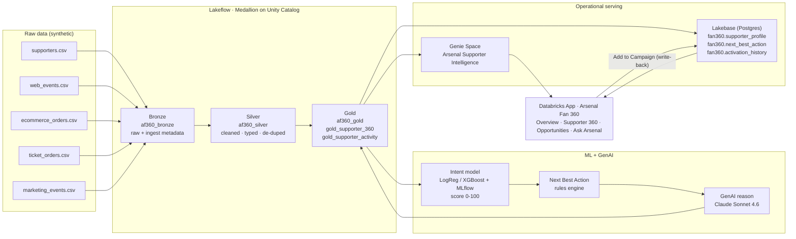

# Arsenal Fan 360 — Next Best Action

> **Turn supporter signals into the next best action.**

Arsenal Fan 360 is an end‑to‑end Databricks prototype that unifies raw supporter data into a governed
**Customer 360**, scores every supporter for **purchase / engagement intent**, decides the **Next Best Action**
(NBA) with rules + a **GenAI‑written reason**, serves it operationally from **Lakebase**, lets marketers explore it
in a **Genie** space, and surfaces everything in a polished **Databricks App**.

- **GitHub repo:** https://github.com/VGokulPillai/arsenal-fan-360
- **Live app:** https://arsenal-fan-360-7474651167448568.aws.databricksapps.com
- **Workspace:** https://fevm-serverless-stable-1acr1x.cloud.databricks.com/?o=7474651167448568
- **Catalog:** `serverless_stable_1acr1x_catalog` → schemas `af360_bronze`, `af360_silver`, `af360_gold`
- **Genie space:** `01f1b9fe891814be841d05a418e8b32d` — *Arsenal Supporter Intelligence*
- **Lakebase:** instance `arsenal-lakebase`, schema `fan360`

> All data is **100% synthetic** (Faker + persona simulation). No real supporter PII is used.

---

## The business problem

A football club has millions of interactions — web sessions, ticket browsing, merch orders, matchday
attendance, email campaigns — spread across disconnected systems. Marketing can't answer simple questions:
*Who is about to buy? Who's lapsing? Who should we invite to hospitality?* Arsenal Fan 360 stitches those
signals into one supporter view and, for **every** supporter, recommends the single best next action.

The demo persona is **Emile (S004917)** — a high‑intent supporter (score **82**) who has been browsing tickets
but hasn't bought. The system recommends **Match Ticket** and a marketer adds him to a campaign in one click.

---

## Architecture



**Flow:** Raw Data → Lakeflow → Unity Catalog → Gold Customer 360 → ML/GenAI → Lakebase → Genie → Databricks App.

---

## What's inside (verified, working)

| Stage | Result | Evidence |
|---|---|---|
| **Synthetic data** | 5,000 supporters · 20,000 web · 8,030 ecom · 5,000 tickets · 10,000 marketing | [`data/`](data) |
| **Lakeflow medallion** | Bronze→Silver→Gold executed; 30 duplicate orders removed in Silver | [`evidence/pipeline_output.txt`](evidence/pipeline_output.txt) |
| **Customer 360** | `gold_supporter_360` (5,000 rows) + `gold_supporter_activity` (43,000 rows) | [`evidence/gold_query_results.txt`](evidence/gold_query_results.txt) |
| **Unity Catalog governance** | schema/table/column comments, table & column tags (classification, pii_type) | [`evidence/unity_catalog_governance.txt`](evidence/unity_catalog_governance.txt) |
| **ML intent model** | Best = Logistic Regression, **AUC 0.9205**; logged to MLflow (both models) | [`evidence/ml_model_metrics.txt`](evidence/ml_model_metrics.txt) |
| **Scores + NBA** | 333 high / 1,326 medium / 3,341 low intent; 6 NBA types | [`evidence/model_predictions.txt`](evidence/model_predictions.txt) |
| **GenAI reasons** | Per‑supporter natural‑language recommendation reason (Claude Sonnet 4.6) | [`evidence/genai_recommendations.txt`](evidence/genai_recommendations.txt) |
| **Lakebase serving** | `supporter_profile` 5,000 · `next_best_action` 5,000 · `activation_history` write‑back | [`evidence/lakebase_results.txt`](evidence/lakebase_results.txt) |
| **Genie space** | 4 verified natural‑language questions with generated SQL + answers | [`evidence/genie_queries.txt`](evidence/genie_queries.txt) |
| **Deployed app** | Live API + SPA; overview, detail, opportunities, write‑back, Genie ask | [`evidence/app_test_output.txt`](evidence/app_test_output.txt) |

> **The evaluator is text‑only** — every stage above is proven by committed text output in [`evidence/`](evidence),
> not screenshots.

---

## Repository structure

```
arsenal-fan-360/
├── README.md
├── data/                       # synthetic data generator + generated CSVs
│   └── generate_supporter_data.py
├── lakeflow/                   # medallion SQL + Python runner
│   ├── bronze_pipeline.sql
│   ├── silver_pipeline.sql
│   ├── gold_pipeline.sql
│   └── run_pipeline.py
├── unity_catalog/
│   └── governance.sql          # comments, tags, classifications
├── ml/
│   └── train_intent_model.py   # Databricks notebook: model + GenAI + MERGE
├── lakebase/
│   ├── schema.sql              # fan360 operational DDL
│   └── sync_supporters.py      # Databricks notebook: sync Gold → Lakebase
├── genie/
│   ├── create_genie_space.py
│   ├── genie_setup.md
│   └── example_questions.md    # verified questions + SQL + answers
├── notebooks/                  # ordered 01–06 orchestration notebooks
├── app/                        # Databricks App (FastAPI + React)
│   ├── app.py  app.yaml  requirements.txt
│   ├── server/                 # store, db (Lakebase), genie, routes
│   └── frontend/               # React + Vite + Tailwind (+ built frontend_dist)
├── scripts/                    # dbsql helper + snapshot generator
└── evidence/                   # TEXT execution evidence for every stage
```

---

## The Databricks App

Four sections, reusing the Arsenal visual identity (crest, Emirates imagery, red `#EF0107` / navy / gold):

1. **Overview** — KPI tiles (supporters, high‑intent, revenue, matches, open opportunities), intent distribution,
   NBA mix, revenue by segment, engagement trend.
2. **Supporter 360** — search a supporter → profile, **intent gauge (0–100)**, recommended NBA + GenAI reason,
   full activity timeline, and **Add to Campaign** (writes to Lakebase `activation_history`).
3. **Opportunities** — cohort cards (Ticket Intent, Merchandise, Membership, Hospitality, Experience,
   Re‑engagement) each drilling into the ranked supporters.
4. **Ask Arsenal** — natural‑language Q&A backed by the Genie space (with an analytics fallback resolver).

**Data access is dual‑mode:** when a Lakebase database resource is attached the app reads/writes live Postgres;
otherwise it serves the governed Gold snapshot and logs activations in memory. The deployed instance currently
serves the **Gold snapshot** (`/api/health` → `data_source: "Gold snapshot (Delta Customer 360)"`, 5,000
supporters); the Lakebase write‑back path is proven live in [`evidence/lakebase_results.txt`](evidence/lakebase_results.txt).

---

## Reproduce it

Prerequisites: Databricks CLI authenticated to the workspace (`databricks auth login`), a SQL warehouse, and
`DATABRICKS_AUTH_STORAGE=plaintext` for the profile used below.

```bash
# 0. profile / warehouse
export DBX_PROFILE=fe-vm-serverless-stable-1acr1x
export DBX_WAREHOUSE=4484f27c707c5a31

# 1. generate synthetic data
python3 data/generate_supporter_data.py --out data/raw_data --seed 7

# 2. (upload CSVs to the UC Volume landing zone, then) run the medallion pipeline
python3 lakeflow/run_pipeline.py          # bronze → silver → gold + row-count evidence

# 3. apply Unity Catalog governance
python3 scripts/dbsql.py exec-file unity_catalog/governance.sql

# 4. ML + GenAI (run ml/train_intent_model.py as a Databricks serverless notebook job)
# 5. Lakebase sync   (run lakebase/sync_supporters.py as a Databricks serverless notebook job)
# 6. Genie space
python3 genie/create_genie_space.py

# 7. build + deploy the app
cd app/frontend && npx vite build && cd ..
databricks apps deploy arsenal-fan-360 --source-code-path /Workspace/Users/<you>/arsenal-fan-360-app
```

The ordered, self‑contained versions live in [`notebooks/`](notebooks) (`01_generate_data` … `06_validation`).

---

## Notable behavioural patterns in the synthetic data

The generator injects realistic, *interesting* cohorts so the NBA logic has something to find:

- **Ticket browsers who don't buy** → *Match Ticket*
- **Cart abandoners** → *Merchandise*
- **Frequent attendees who aren't members** → *Membership Upgrade*
- **Big merch spenders / VIPs** → *Hospitality*
- **Lapsed supporters** (no activity 90d+) → *Re‑engagement*
- **International merch buyers** → cross‑sell

It also injects dirty rows (mixed casing, whitespace, missing `age_band`) and 30 duplicate orders so the Silver
layer's cleaning and de‑duplication are demonstrable.
