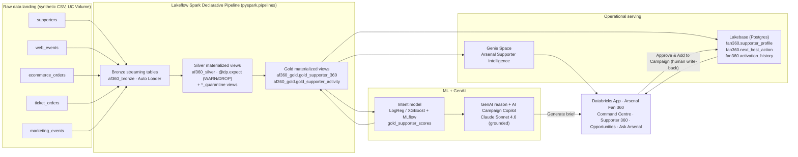

# Arsenal Fan 360 — Commercial Command Centre

> **Turn supporter signals into revenue — with a human always in the loop.**

Arsenal Fan 360 is an end‑to‑end Databricks prototype for a **specific industry (professional sports / football
clubs)** and a **specific customer problem**: a club has millions of supporter interactions scattered across
systems and no single, trustworthy view of *which supporters are about to buy, which are lapsing, and what the
club should do next*. Arsenal Fan 360 unifies those signals into a governed **Customer 360**, scores every
supporter for **purchase / engagement intent**, recommends a **Next Best Action**, drafts a **human‑reviewed AI
campaign brief**, serves it operationally from **Lakebase**, answers executive questions in a **Genie** space, and
surfaces everything in a polished **Databricks App**.

- **GitHub repo:** https://github.com/VGokulPillai/arsenal-fan-360
- **Live app:** https://arsenal-fan-360-7474651167448568.aws.databricksapps.com
- **Workspace:** https://fevm-serverless-stable-1acr1x.cloud.databricks.com/?o=7474651167448568
- **Catalog:** `serverless_stable_1acr1x_catalog` → schemas `af360_bronze`, `af360_silver`, `af360_gold`
- **Genie space:** `01f1b9fe891814be841d05a418e8b32d` — *Arsenal Supporter Intelligence*
- **Lakebase:** instance `arsenal-lakebase`, schema `fan360`

> All data is **100% synthetic** (persona‑driven simulation). **No real supporter PII** and **no real Arsenal
> employee is named**. Financial figures in the business case are **illustrative**, not actual Arsenal results.

---

## 1. Who this is for (the business buyers)

The demo is written for two **representative** football‑club executives (not real, named Arsenal employees):

| Persona | Role | What they care about |
|---|---|---|
| **Economic buyer** | **Chief Commercial Officer (CCO)** | Grow supporter revenue, ticket/membership/hospitality conversion, revenue per supporter, and stop leaking value from un‑activated high‑intent supporters. |
| **Operational owner** | **Head of Fan Engagement / CRM** | Find high‑intent supporters, prioritise campaign audiences, kill generic blast campaigns, lift conversion, re‑engage lapsing supporters, and activate them fast. |

The app opens on a **Commercial Command Centre** that speaks their language: commercial KPIs, commercial
opportunities, and an illustrative business case — all computed from the data, not hard‑coded.

## 2. The business problem

Web sessions, ticket browsing, merch orders, matchday attendance and email campaigns live in disconnected
systems. Marketing can't answer simple commercial questions — *Who is about to buy? Who's lapsing? Who should we
invite to hospitality?* — so campaigns are generic, high‑intent supporters go un‑activated, and revenue leaks.

## 3. The solution

Arsenal Fan 360 stitches every signal into one supporter view and, for **every** supporter, recommends the single
best next action, drafts a grounded campaign brief with GenAI, and **requires a human to approve** before anything
is queued. The demo hero is **Emile (S004917)** — a high‑intent supporter (intent **82/100**) browsing tickets but
not buying → recommended **Match Ticket** → the AI Copilot drafts a grounded brief → a marketer clicks
**Approve & Add to Campaign** → the decision is written back to Lakebase. Nothing is auto‑sent.

## 4. Commercial outcomes (observed from the synthetic Gold data)

| Commercial KPI | Value |
|---|---|
| Total supporter value | **£1,175,207** |
| High‑intent supporters (intent ≥ 70) | **333** |
| High‑intent supporter value | **£76,152** |
| Membership opportunity | **803 supporters · £233,432** |
| Hospitality opportunity | **522 supporters · £190,366** |
| Merchandise opportunity | **919 supporters · £219,833** |
| Re‑engagement opportunity | **311 supporters · £27,585** |

**Illustrative business case** *(clearly labelled — not actual Arsenal financials):* scaling the observed
addressable opportunity to a representative 250k supporter base and applying tunable assumptions (8% baseline
conversion, 25% AI uplift, 60% margin, £120k platform cost) yields an **incremental gross contribution of
~£412,727**, **ROI ≈ 2.4×**, **payback ≈ 3.5 months**. Every number is computed in code
([`evidence/executive_metrics.txt`](evidence/executive_metrics.txt)) and separated into *observed from data* vs
*illustrative scenario*.

---

## 5. Architecture



**Flow:** Raw data → **Lakeflow SDP** → Unity Catalog medallion → Gold Customer 360 → **ML/GenAI** →
**Lakebase** + **Genie** → **Databricks App** → human‑approved write‑back to Lakebase.

The SDP owns Bronze/Silver and the base `gold_supporter_360`/`gold_supporter_activity`; the ML job owns
`gold_supporter_scores`; `gold_supporter_360` prefers the ML overlay on each refresh, so the app, Genie and
evidence all show identical intent/NBA values.

---

## 6. Lakeflow Spark Declarative Pipeline & Data Quality

`lakeflow/pipeline.py` is a genuine **Spark Declarative Pipeline** (`from pyspark import pipelines as dp`), not a
SQL runner. It declares **17 datasets** and Lakeflow resolves the dependency graph automatically:

- **5 Bronze streaming tables** (`@dp.table`) ingested with **Auto Loader** (`spark.readStream.format("cloudFiles")`)
  with schema evolution + rescue.
- **5 Silver materialized views** (`@dp.materialized_view`) with **expectations**:
  - `@dp.expect_all_or_drop` — hard integrity (non‑null ids, valid timestamps, non‑negative revenue/price,
    order_id present). Failing rows are **dropped and quarantined**.
  - `@dp.expect_all` — WARN‑only checks (valid membership tier, known event type, match populated) that keep the
    row but flag it.
- **5 Silver `*_quarantine` views** preserving rejected rows with a `_reject_reason` (nothing is silently lost).
- **2 Gold materialized views** including a one‑row‑per‑supporter Customer 360.

**Measured data‑quality results** (from a real pipeline update, row counts queried from the produced tables —
[`evidence/lakeflow_quality_results.txt`](evidence/lakeflow_quality_results.txt)):

| | Bronze ingested | Silver passing | Quarantined | Notes |
|---|---|---|---|---|
| supporters | 5,002 | 5,000 | 2 | null/empty supporter_id dropped |
| web_events | 20,005 | 20,001 | 4 | 1 unknown event_type kept (WARN) |
| ecommerce_orders | 8,034 | 8,000 | 4 | **+30 duplicate orders removed** |
| ticket_orders | 5,002 | 5,000 | 2 | negative price dropped |
| marketing_events | 10,002 | 10,000 | 2 | invalid timestamp dropped |

**15 malformed rows** were intentionally injected across the 5 sources; **14 were caught and quarantined** by DROP
expectations and **1 was retained** by a WARN expectation (proving WARN vs DROP differ). **30 duplicate** ecommerce
orders were removed by declarative dedup. Gold is verified **one row per supporter** (5,000 unique).

---

## 7. Synthetic data (persona‑driven, documented, profiled)

`data/generate_supporter_data.py` simulates **6 supporter cohorts** with realistic behavioural signatures,
intentional correlations (membership ↔ attendance, value ↔ hospitality, browsing ↔ intent, opt‑in ↔ engagement),
temporal realism (recency‑weighted activity, lapsed supporters skew old) and **data‑quality edge cases**
(dirty‑but‑usable rows cleaned in Silver + malformed rows dropped by expectations). It is documented in
[`data/README.md`](data/README.md) and profiled — with **actual calculated statistics** — in
[`evidence/synthetic_data_profile.txt`](evidence/synthetic_data_profile.txt).

Volumes: **5,000 supporters · 20,000 web · 8,030 ecom · 5,000 tickets · 10,000 marketing** (+ a handful of
malformed rows for the quality gates). No real PII.

---

## 8. AI Campaign Copilot (human‑in‑the‑loop)

A lightweight (not multi‑agent) copilot in `app/server/copilot.py`:

**signal → ML intent → Next Best Action → GenAI explanation → GenAI campaign brief → human review → approve →
write back to Lakebase.**

The brief (objective, why‑now, channel, offer angle, suggested message, primary/supporting KPI, risk/guardrail) is
generated by the live Foundation Model (`databricks-claude-sonnet-4-6`), **instructed to use ONLY the supplied
Customer‑360 facts**. The UI shows *"AI‑generated campaign brief — human approval required. No campaign is sent
automatically."* On **Approve & Add to Campaign** the app writes an extended row to `fan360.activation_history`
(`next_best_action`, `campaign_objective`, `recommended_channel`, `campaign_message`, `approved_by_user`,
`approved_at`, `status`). Real, grounded output in
[`evidence/ai_campaign_copilot.txt`](evidence/ai_campaign_copilot.txt).

---

## 9. What's inside (verified, working — text evidence)

| Stage | Result | Evidence |
|---|---|---|
| **Synthetic data** | 5,000 supporters + events, persona‑driven, profiled from real stats | [`evidence/synthetic_data_profile.txt`](evidence/synthetic_data_profile.txt) · [`data/README.md`](data/README.md) |
| **Lakeflow SDP + DQ** | Real `pyspark.pipelines`; 14 rows quarantined, 30 dupes removed, Gold 1‑row‑per‑supporter | [`evidence/lakeflow_quality_results.txt`](evidence/lakeflow_quality_results.txt) |
| **Customer 360** | `gold_supporter_360` (5,000) + `gold_supporter_activity` (43,001) | [`evidence/gold_query_results.txt`](evidence/gold_query_results.txt) |
| **Unity Catalog governance** | schema/table/column comments + classification/pii tags | [`evidence/unity_catalog_governance.txt`](evidence/unity_catalog_governance.txt) |
| **ML intent model** | LogReg vs XGBoost compared, best AUC logged to MLflow | [`evidence/ml_model_metrics.txt`](evidence/ml_model_metrics.txt) |
| **Scores + NBA** | 333 high / medium / low intent; 6 NBA types | [`evidence/model_predictions.txt`](evidence/model_predictions.txt) |
| **GenAI reasons** | Per‑supporter recommendation reason (Claude Sonnet 4.6) | [`evidence/genai_recommendations.txt`](evidence/genai_recommendations.txt) |
| **AI Campaign Copilot** | Grounded, human‑approved briefs (live Foundation Model) | [`evidence/ai_campaign_copilot.txt`](evidence/ai_campaign_copilot.txt) |
| **Executive metrics** | Personas + commercial KPIs + illustrative business case, computed from data | [`evidence/executive_metrics.txt`](evidence/executive_metrics.txt) |
| **Lakebase serving** | profiles/NBA served + human‑approved write‑back | [`evidence/lakebase_results.txt`](evidence/lakebase_results.txt) |
| **Genie space** | Executive questions answered live with generated SQL | [`evidence/genie_queries.txt`](evidence/genie_queries.txt) |
| **Deployed app** | Live API on Lakebase + Genie + Copilot | [`evidence/app_test_output.txt`](evidence/app_test_output.txt) |

> **The evaluator is text‑only** — every stage is proven by committed text output in [`evidence/`](evidence),
> not screenshots.

---

## 10. The Databricks App

Four sections, reusing the Arsenal visual identity (crest, Emirates imagery, red `#EF0107` / navy / gold):

1. **Overview / Commercial Command Centre** — Executive Lens (CCO + Head of Fan Engagement personas), commercial
   KPIs, commercial opportunities (count / value / avg intent), and the illustrative business case; plus intent
   distribution, NBA mix, revenue by segment, engagement trend.
2. **Supporter 360** — search → profile, intent gauge (0–100), NBA + GenAI reason, activity timeline,
   **Generate Campaign Brief** (AI Copilot) → **Approve & Add to Campaign** (write‑back to Lakebase).
3. **Opportunities** — cohort cards with cohort value, average intent, and the likely owner / KPI, each drilling
   into ranked supporters.
4. **Ask Arsenal** — natural‑language executive Q&A backed by the Genie space (with an analytics fallback).

**The deployed app runs 100% live** (see [`evidence/app_test_output.txt`](evidence/app_test_output.txt)):

- **Live Lakebase** — a `database` resource is attached; the app SP reads `fan360.supporter_profile` /
  `next_best_action` and writes `fan360.activation_history` over Postgres. `/api/health` reports
  `data_source: "Databricks Lakebase (operational)", lakebase: true`; the Copilot write‑back returns
  `store: "Databricks Lakebase"`.
- **Live Genie** — the app SP has `CAN_RUN` on the space, so "Ask Arsenal" calls the real Genie space
  (`source: "Databricks Genie Space"`, e.g. high‑intent value **£76,152.02**).

Data access is **dual‑mode**: if Lakebase/Genie are unreachable the app degrades gracefully to the governed Gold
snapshot and a local resolver, so it always runs.

---

## 11. Repository structure

```
arsenal-fan-360/
├── README.md
├── data/                       # synthetic data generator + docs
│   ├── generate_supporter_data.py
│   └── README.md               # personas, correlations, temporal + edge cases
├── lakeflow/
│   ├── pipeline.py             # Spark Declarative Pipeline (pyspark.pipelines) ← primary
│   └── *.sql                   # earlier medallion SQL (reference only)
├── unity_catalog/governance.sql
├── ml/train_intent_model.py    # LogReg vs XGBoost + MLflow + GenAI → gold_supporter_scores
├── lakebase/
│   ├── schema.sql              # fan360 operational DDL (incl. Copilot write-back columns)
│   ├── sync_supporters.py      # sync Gold(+scores) → Lakebase
│   └── alter_activation_history.py
├── genie/                      # space creation + verified questions
├── app/                        # Databricks App (FastAPI + React)
│   ├── app.py  app.yaml  requirements.txt
│   ├── server/                 # store, db (Lakebase), genie, copilot, routes
│   └── frontend/ + frontend_dist/   # React + Vite + Tailwind (built)
├── scripts/                    # dbsql helper + snapshot generator
└── evidence/                   # TEXT execution evidence for every stage
```

---

## 12. Reproduce it

Prerequisites: Databricks CLI authenticated to the workspace, a SQL warehouse, and
`DATABRICKS_AUTH_STORAGE=plaintext` for the profile used below.

```bash
export DBX_PROFILE=fe-vm-serverless-stable-1acr1x
export DBX_WAREHOUSE=4484f27c707c5a31

# 1. generate synthetic data (+ profile)
python3 data/generate_supporter_data.py --out data/raw_data --seed 7

# 2. upload CSVs to the UC Volume landing zone, then run the Lakeflow SDP
#    (lakeflow/pipeline.py registered as a Lakeflow pipeline; run an update)
databricks pipelines start-update <pipeline_id>

# 3. Unity Catalog governance
python3 scripts/dbsql.py exec-file unity_catalog/governance.sql

# 4. ML + GenAI  (run ml/train_intent_model.py as a serverless notebook job) → gold_supporter_scores
#    then refresh the SDP so gold_supporter_360 picks up the ML overlay
# 5. Lakebase sync (run lakebase/sync_supporters.py as a serverless notebook job)
# 6. Genie space   (genie/create_genie_space.py) + grant the app SP CAN_RUN
# 7. build + deploy the app
cd app/frontend && npx vite build && cd ..
databricks apps deploy arsenal-fan-360 --source-code-path /Workspace/Users/<you>/arsenal-fan-360-app
```

---

## 13. Guardrails honoured

- **No real supporter PII** — 100% synthetic, persona‑driven.
- **No real Arsenal employee named** — buyers are representative roles (CCO, Head of Fan Engagement / CRM).
- **No faked execution output** — every metric is queried/computed and committed under [`evidence/`](evidence).
- **No claimed Arsenal financials** — the business case is explicitly *illustrative* and separated from observed data.
- **Human‑in‑the‑loop** — the AI Copilot drafts; a human approves; nothing is auto‑sent.
- **No credentials in Git** — auth uses the workspace profile / injected app resources; tokens are minted at runtime.
